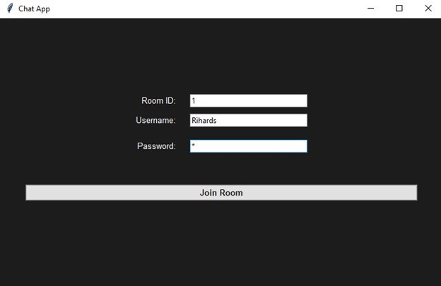
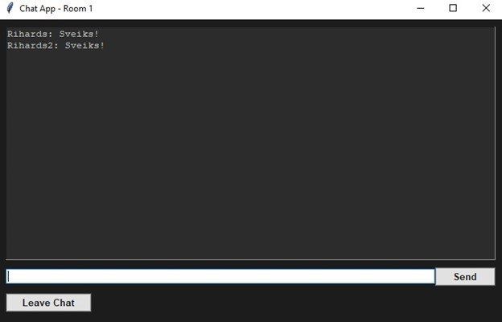
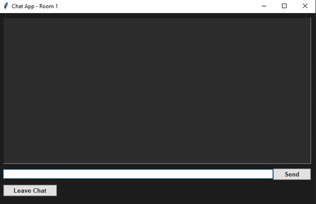

Privacy-Oriented Messaging App

A lightweight Python-based chat application focused on user **privacy** and **security**, using end-to-end encryption. 
No messages are stored — they are only relayed through the server.

🛠️Tech Stack

- **Python 3**
- `socket` – for network communication
- `cryptography` – for RSA encryption
- `tkinter` – for the GUI

💡Main Features

- End-to-end encrypted messaging
- No message history saved
- Room-based login with password
- Graphical interface for ease of use

Screenshots
| **Login Window** | **Main Chat Window** | **Chatting Process** |
|:----------------:|:--------------------:|:--------------------:|
|  |  |  |

